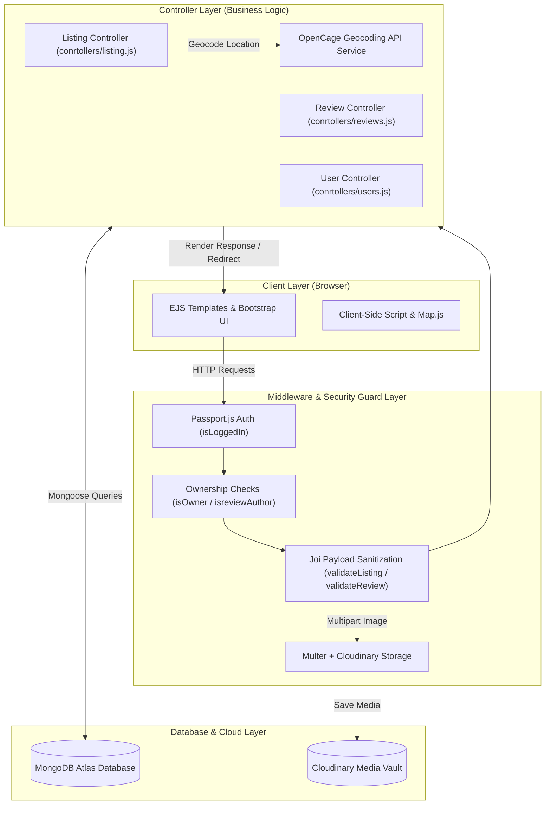
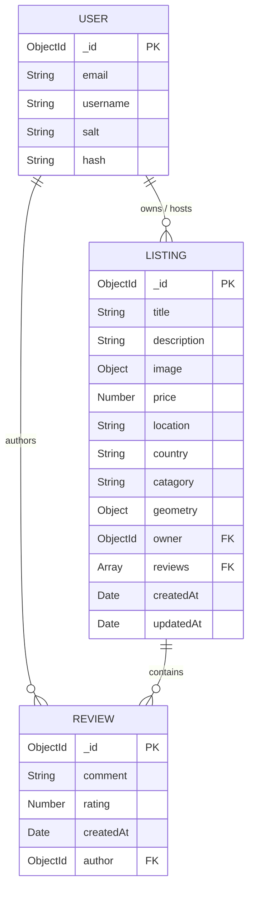

# 🌍 Wanderlust - Vacation Rental & Accommodation Marketplace

> A modern, full-stack web application designed for listing, discovering, and reviewing unique properties and vacation rentals worldwide. Inspired by Airbnb, Wanderlust offers seamless accommodation discovery, dynamic map visualization, user reviews, secure authentication, and cloud-based image management.

---

## 📋 Table of Contents

- [Overview & Key Features](#-overview--key-features)
- [Problem & Solution](#-problem--solution)
- [System Architecture](#-system-architecture)
- [Tech Stack](#-tech-stack)
- [Project Directory Structure](#-project-directory-structure)
- [Database Schema & Data Models](#-database-schema--data-models)
- [API Endpoints Reference](#-api-endpoints-reference)
- [Environment Variables](#-environment-variables)
- [Getting Started & Installation](#-getting-started--installation)
- [Database Seeding](#-database-seeding)
- [Key Workflows & Implementation Highlights](#-key-workflows--implementation-highlights)
- [Future Roadmap](#-future-roadmap)
- [Author & License](#-author--license)

---

## ✨ Overview & Key Features

Wanderlust provides an end-to-end platform for both property hosts and travelers.

### 🌟 Core Capabilities
- 🔐 **User Authentication & Authorization**: Session-backed user signup, login, and logout powered by `Passport.js`. Strict ownership checks (`isOwner`, `isreviewAuthor`) restrict editing/deleting rights to authorized creators.
- 🏡 **Complete Listing Management (CRUD)**: Create, view, update, and delete property listings with titles, detailed descriptions, pricing, custom category tags, and location data.
- 🗺️ **Geocoding & Interactive Maps**: Automatic location geocoding via the **OpenCage Data API** to convert plain-text addresses into GeoJSON coordinates (`[longitude, latitude]`), visualized on interactive **Leaflet.js** maps with map markers.
- 📸 **Cloud-Based Image Storage**: Direct photo uploads managed via **Multer** and stored securely on **Cloudinary**, featuring automatic image compression and blur-preview transformations.
- ⭐ **Rating & Review System**: Interactive 1–5 star ratings and comment threads per listing with automatic cascade cleanup upon property deletion.
- 🔍 **Real-Time Location Search**: Dynamic case-insensitive regex search engine matching destinations by title, location, or country.
- 🏷️ **Dynamic Pricing & Tax Calculation**: Interactive UI switch allowing users to toggle dynamic price rendering (+18% GST).
- 🛡️ **Schema Validation & Error Handling**: Server-side request sanitization using **Joi** schemas, centralized custom `ExpressError` handling, and client-side Bootstrap form validation.

---

## 🎯 Problem & Solution

### The Problem
Travelers face fragmented listing platforms with inaccurate geographical location mapping, opaque pricing details, and unverified user reviews. On the host side, property owners lack an intuitive tool to market their properties with multi-image cloud uploads and granular control over listing edits.

### The Solution
Wanderlust synthesizes property management, geocoding, authentication, and review capabilities into a single MVC-driven Node.js & Express architecture:
- **For Travelers**: Clear category navigation, interactive map-based location visualization, transparent tax calculation, and real guest reviews.
- **For Hosts**: Simple property onboard flow, Cloudinary image upload pipeline, and secure owner-only management controls.

---

## 🏗️ System Architecture

Wanderlust is designed following the classic **Model-View-Controller (MVC)** architectural pattern to ensure strict separation of concerns, scalability, and modular maintenance.



### Request Lifecycle Workflow
1. **Client Request**: User submits a form (e.g., creating a new property listing with an image upload).
2. **Middleware Interception**:
   - `isLoggedIn`: Verifies active session token.
   - `upload.single("listing[image]")`: Parses multipart form data and streams the file to Cloudinary.
   - `validateListing`: Validates payload against the Joi schema (`schema.js`).
3. **Controller Processing**: The controller extracts form fields, invokes the **OpenCage API** for latitude/longitude geocoding, attaches user metadata, and updates MongoDB via Mongoose models.
4. **View Rendering**: Express renders the corresponding EJS template using `ejs-mate` layouts and returns dynamic HTML back to the user.

---

## 🛠️ Tech Stack

| Category | Technology | Description |
| :--- | :--- | :--- |
| **Backend Runtime** | [Node.js](https://nodejs.org/) (v20+) | Asynchronous event-driven JavaScript engine |
| **Web Framework** | [Express.js](https://expressjs.com/) (v4.21) | Robust RESTful web application framework |
| **Database** | [MongoDB Atlas](https://www.mongodb.com/cloud/atlas) | Cloud NoSQL document database |
| **ODM** | [Mongoose](https://mongoosejs.com/) (v8.15) | Object Data Modeling library for MongoDB |
| **Template Engine** | [EJS](https://ejs.co/) & [EJS-Mate](https://github.com/mde/ejs) | Server-side templating engine with layouts & partials |
| **Authentication** | [Passport.js](http://www.passportjs.org/) | Express-compatible authentication middleware |
| **Session Store** | [connect-mongo](https://github.com/jdesboeufs/connect-mongo) & `express-session` | Persistent MongoDB-backed HTTP session store |
| **Validation** | [Joi](https://joi.dev/) (v17.13) | Schema description and data validator for JavaScript |
| **Cloud Storage** | [Cloudinary API](https://cloudinary.com/) | Cloud storage & image transformation service |
| **File Handling** | [Multer](https://github.com/expressjs/multer) & `multer-storage-cloudinary` | Middleware for handling `multipart/form-data` |
| **Geocoding & Maps**| [OpenCage API](https://opencagedata.com/) & [Leaflet.js](https://leafletjs.com/) | Geocoding service & interactive JS mapping library |
| **Frontend Styling**| [Bootstrap 5](https://getbootstrap.com/) & FontAwesome | Responsive UI layout framework and icon system |

---

## 📂 Project Directory Structure

```directory
Major Project-1/
├── app.js                    # Application entry point, session setup, router mounts & error handling
├── cloudConfig.js            # Cloudinary API credential setup and Multer storage engine
├── middleware.js             # Custom authorization (isLoggedIn, isOwner) & Joi middleware validators
├── schema.js                 # Joi object validation schemas for listings and reviews
├── package.json              # Project dependencies, scripts, and Node engine specifications
├── .env                      # Environment variable definitions (secrets, database URIs, API keys)
│
├── conrtollers/              # Business logic handlers (MVC Controller Layer)
│   ├── listing.js            # Listing CRUD, geocoding logic, and image upload execution
│   ├── reviews.js            # Review creation and deletion controller methods
│   └── users.js              # User registration, authentication login, and logout handlers
│
├── models/                   # Mongoose data schemas (MVC Model Layer)
│   ├── listing.js            # Property Listing schema with GeoJSON point coordinates & refs
│   ├── review.js             # Review schema with rating, comment text, and author ref
│   └── user.js               # Passport-Local-Mongoose user authentication schema
│
├── routes/                   # Express modular route definitions
│   ├── listings.js           # Property listing RESTful endpoints (/listings)
│   ├── review.js             # Nested review endpoints (/listings/:id/reviews)
│   ├── search.js             # Search filtering engine endpoints (/search)
│   └── user.js               # User auth endpoints (/signup, /login, /logout)
│
├── views/                    # EJS templates (MVC View Layer)
│   ├── layouts/              # Core layout wrapper (boilerplate.ejs)
│   ├── includes/             # Shared UI components (navbar.ejs, fotter.ejs, flash.ejs)
│   ├── listings/             # Listing pages (index.ejs, show.ejs, new.ejs, edit.ejs, search.ejs)
│   ├── Users/                # Auth pages (login.ejs, signup.ejs)
│   └── error.ejs             # Global custom error handling view
│
├── public/                   # Static client assets
│   ├── css/                  # Custom CSS stylesheets (style.css, rating.css)
│   └── js/                   # Client-side scripts (map.js, script.js for form validation)
│
├── init/                     # Database seeding utilities
│   ├── data.js               # Pre-populated sample listing objects
│   └── index.js              # Database reset and populator script
│
└── utils/                    # Utility helper functions
    ├── ExpressError.js       # Custom error class extending standard JS Error
    └── wrapAsync.js          # Async wrapper utility replacing try-catch blocks in routes
```

---

## 🗄️ Database Schema & Data Models

The MongoDB database consists of three interconnected models linked by ObjectIDs:



### Model Definitions

#### 1. Listing Model (`models/listing.js`)
- `title` (String, required): Property name.
- `description` (String): Property detailed overview.
- `image` (Object): Contains Cloudinary `url` and `filename`.
- `price` (Number, required): Nightly rate in INR.
- `location` (String): City/Region name.
- `country` (String): Country name.
- `reviews` (Array of ObjectIds): References to associated `Review` documents.
- `owner` (ObjectId): Reference to `User` document who created the listing.
- `geometry` (GeoJSON Point): Coordinates stored as `{ type: "Point", coordinates: [longitude, latitude] }`.
- `catagory` (String): Enum filter (`Trending`, `Rooms`, `Iconic Cities`, `Mountains`, `Castles`, `Amazing Pools`, `Camping`, `Farm Stays`, `Arctic`, `Beach`, `Cabins`, `Caves`, `Boating`).

#### 2. Review Model (`models/review.js`)
- `comment` (String): Guest review commentary.
- `rating` (Number): Rating integer between 1 and 5.
- `createdAt` (Date): Creation timestamp.
- `author` (ObjectId): Reference to `User` who wrote the review.

#### 3. User Model (`models/user.js`)
- `email` (String, required): User email address.
- `username` & `hash` & `salt`: Managed automatically by `passport-local-mongoose`.

---

## 🔌 API Endpoints Reference

### Property Listing Routes (`/listings`)

| Method | Endpoint | Authorization | Description |
| :--- | :--- | :--- | :--- |
| `GET` | `/listings` | Public | Display index of all listings with categories and tax toggle |
| `GET` | `/listings/new` | Authenticated | Render form to create a new property listing |
| `POST` | `/listings` | Authenticated | Process new listing creation with Cloudinary image upload |
| `GET` | `/listings/:id` | Public | Display detailed listing page with reviews and map location |
| `GET` | `/listings/:id/edit` | Listing Owner | Render property editing form |
| `PUT` | `/listings/:id` | Listing Owner | Update property details and optional new photo |
| `DELETE`| `/listings/:id` | Listing Owner | Remove property and cascade-delete associated reviews |
| `GET` | `/listings/api/listings`| Public | REST JSON endpoint returning all raw listing data for map API |

### Review Routes (`/listings/:id/reviews`)

| Method | Endpoint | Authorization | Description |
| :--- | :--- | :--- | :--- |
| `POST` | `/listings/:id/reviews` | Authenticated | Create a rating & review for a specific property |
| `DELETE`| `/listings/:id/reviews/:reviewId` | Review Author | Delete a specific review and pull reference from listing |

### Search Routes (`/search`)

| Method | Endpoint | Authorization | Description |
| :--- | :--- | :--- | :--- |
| `POST` | `/search` | Public | Submit regex location search query |
| `GET` | `/search/results` | Public | Display matching search results |

### Authentication Routes (`/`)

| Method | Endpoint | Authorization | Description |
| :--- | :--- | :--- | :--- |
| `GET` | `/signup` | Public | Render user registration form |
| `POST` | `/signup` | Public | Register new user account and open authenticated session |
| `GET` | `/login` | Public | Render login credential form |
| `POST` | `/login` | Public | Authenticate user credentials and redirect to requested URL |
| `GET` | `/logout` | Authenticated | Terminate session and flash logout confirmation |

---

## 🔑 Environment Variables

To run Wanderlust locally or in production, configure the following variables in a `.env` file at the root of the workspace:

```env
# MongoDB Connection String (Atlas Cloud or Local Instance)
ATLAST_URL=mongodb+srv://<username>:<password>@cluster0.mongodb.net/wonderlust?retryWrites=true&w=majority

# Session Cookie Secret
SECRET=your_super_secret_session_key

# Cloudinary Storage Credentials
CLOUD_NAME=your_cloudinary_cloud_name
CLOUD_API_KEY=your_cloudinary_api_key
CLOUD_API_SECRET=your_cloudinary_api_secret

# OpenCage Data Geocoding API Key
OPENCAGE_API_KEY=your_opencage_api_key

# MapTiler / Mapbox Token (Optional for tile rendering)
MAP_TOKEN=your_map_access_token
```

> [!WARNING]
> Never commit your actual `.env` file to version control. Keep credentials safe and restricted.

---

## 🚀 Getting Started & Installation

Follow these step-by-step instructions to set up Wanderlust on your local workstation.

### Prerequisites
- **Node.js** (v20.x or higher) installed. ([Download Node.js](https://nodejs.org/))
- **MongoDB** local instance running OR a **MongoDB Atlas** cluster database URI.
- **Git** installed on your system.

### Step 1: Clone the Repository
```bash
git clone https://github.com/Mirjaj786/wonderlust.git
cd "Major Project-1"
```

### Step 2: Install Project Dependencies
```bash
npm install
```

### Step 3: Configure Environment Variables
Create a `.env` file in the root folder:
```bash
touch .env
```
Copy the keys listed in the [Environment Variables](#-environment-variables) section into `.env` and insert your API credentials.

### Step 4: Run the Application
For regular execution:
```bash
npm start
```

For development mode (with auto-restart via `nodemon`):
```bash
npm run dev
```

### Step 5: Access the Web Application
Open your web browser and navigate to:
```text
http://localhost:8080/listings
```

---

## 🌱 Database Seeding

The repository comes equipped with pre-configured sample property data located in `init/data.js`. You can re-populate your database at any time using the seed runner:

```bash
node init/index.js
```

> [!NOTE]
> Running the seed script clears existing listings from the target database collection and inserts sample properties with GeoJSON geometry and owner identifiers.

---

## ⚡ Key Workflows & Implementation Highlights

### 1. Robust Async Error Handling Architecture
Instead of repetitive `try-catch` blocks across controller methods, asynchronous operations are wrapped with a higher-order utility function (`utils/wrapAsync.js`):
```javascript
module.exports = (fn) => {
  return (req, res, next) => {
    fn(req, res, next).catch(next);
  };
};
```
Errors triggered downstream are caught and forwarded directly to the central Express error middleware, rendering a uniform `error.ejs` template.

### 2. Double-Layer Schema Sanitization
Data integrity is protected at two distinct boundaries:
- **Client Side**: Custom Bootstrap validation (`needs-validation`) prevents invalid form submission in the browser.
- **Server Side**: `Joi` schema validation interceptors (`validateListing`, `validateReview` in `middleware.js`) strictly inspect request body structures before controller handlers process them.

### 3. Automatic Geocoding Pipeline
When a user inputs a human-readable location string (e.g. `"Jaipur, Rajasthan"`), the listing controller triggers an asynchronous request to OpenCage API:
```javascript
const coordinates = await geocodeLocation(location); // Returns [longitude, latitude]
newListing.geometry = { type: "Point", coordinates };
```
The resulting GeoJSON format is saved natively in MongoDB, enabling Leaflet map rendering.

---

## 🔮 Future Roadmap

- 💳 **Payment Gateway**: Integration with Stripe / Razorpay for booking reservations and security deposits.
- 📅 **Calendar Availability**: Date-picker scheduling system to check property availability in real time.
- 💬 **Host & Guest Chat**: Real-time WebSocket messaging for communication between guests and property managers.
- 🛡️ **User Profile Dashboards**: Host analytics, total earnings metrics, and guest trip history views.

---

## 👤 Author & License

- **Developer**: Mirjaj ([@Mirjaj786](https://github.com/Mirjaj786))
- **Project**: Major Project - Vacation Rental Platform
- **License**: ISC License

---

<p align="center">
  Made with ❤️ by Mirjaj | Powered by Node.js, Express & MongoDB
</p>
